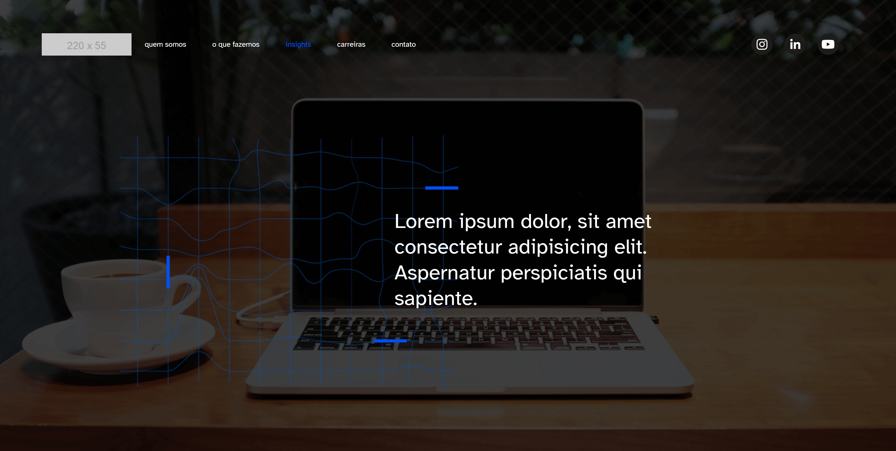

# BootstrapTraining



Este projeto é uma aplicação web simples de múltiplas páginas construída com Webpack. É uma réplica da estrutura do site [RCIIT](https://www.rciit.com/), mas desenvolvida de forma independente por mim, com marcação e estilos originais. O objetivo principal deste projeto foi praticar o uso das classes do Bootstrap e apresentar um exemplo de uma estrutura básica que pode ser utilizada em projetos com Webpack. O projeto pode ser acessado aqui: [https://nothingnothings.github.io/bootstrapTraining/](https://nothingnothings.github.io/bootstrapTraining/).

[](https://github.com/nothingnothings/bootstrapTraining)
[](https://github.com/nothingnothings/bootstrapTraining/blob/master/README.pt-br.md)

## Funcionalidades

- **Estrutura Multi-Página**: O projeto inclui sete páginas distintas.
- **Design Responsivo**: O Bootstrap foi utilizado para layouts responsivos, com foco em mobile-first.
- **Funcionalidade em JavaScript**: JavaScript foi usado para a Sidebar e os carrosséis.
- **Configuração do Webpack**: O projeto foi bundled e estruturado com a ajuda do Webpack.

## Tecnologias Utilizadas

- **Webpack**: Para empacotamento de módulos.
- **HTML Webpack Plugin**: Para gerar arquivos HTML para cada página.
- **Sass**: Para estilização e criação de designs responsivos.
- **Bootstrap**: Para aproveitar estilos e componentes pré-construídos.

## Instalação

Para começar com este projeto, siga estas etapas:

1. **Clone o Repositório**:

```
git clone git@github.com/bootstrapTraining.git
```

2. **Instale as Dependências**:

```
npm install
```

## Executando o Projeto

Para executar o projeto em um ambiente de desenvolvimento local, use:

```
npm start
```

O comando iniciará um servidor local, e entao você poderá visualizar o projeto em seu navegador.


